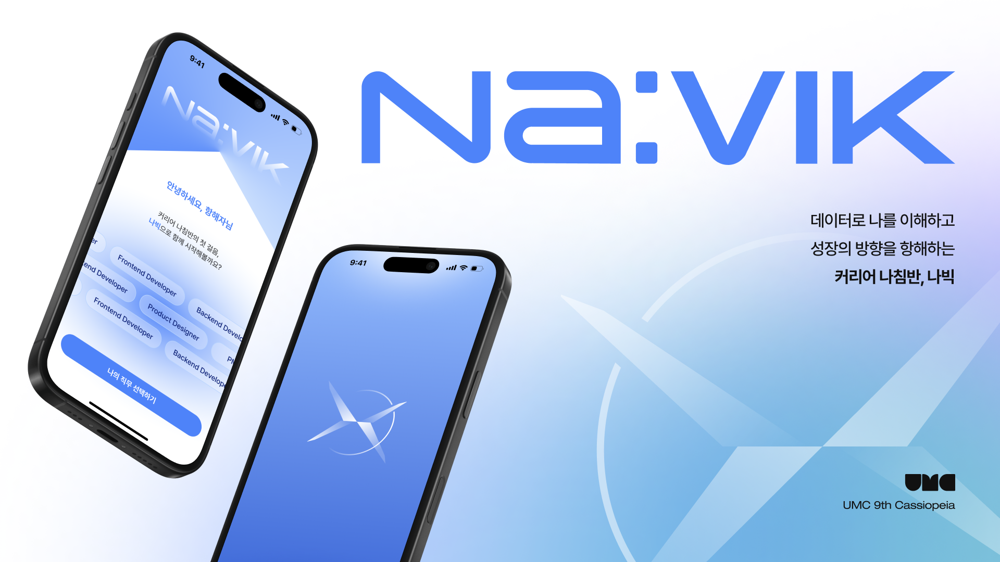
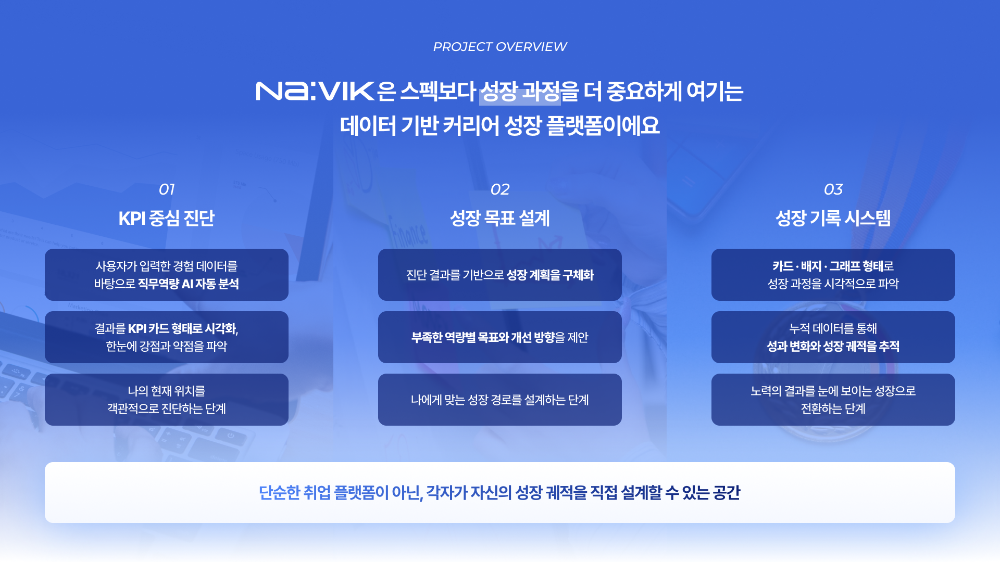
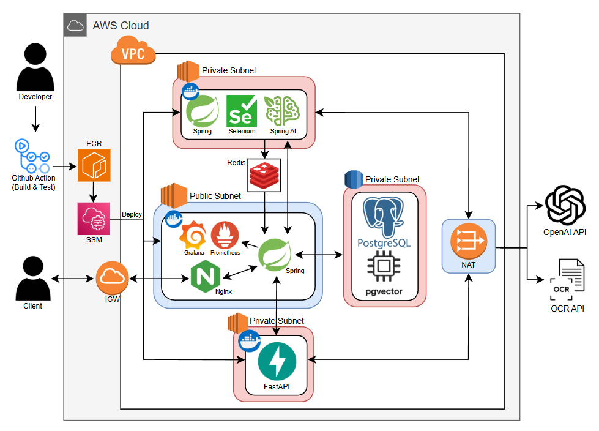

# Navik Backend

> AI 기반 커리어 성장 추적 플랫폼의 백엔드 서버

## Overview

**Navik**은 주니어 개발자가 자신의 성장을 체계적으로 기록하고, AI를 활용해 역량을 분석받으며, 맞춤형 채용 공고와 스터디를 추천받을 수 있는 커리어 성장 플랫폼입니다.


### Why?

- 성장 기록이 파편화되어 있어 본인의 역량 변화를 파악하기 어렵다
- 직무별 핵심 역량(KPI)과 내 현재 수준의 갭을 객관적으로 파악할 수 없다
- 채용 공고·스터디를 직접 찾아야 해서 시간이 많이 든다

### What?

- 성장 로그를 작성하면 AI가 직무 KPI 기준으로 평가해 점수를 매긴다
- 포트폴리오를 업로드하면 AI가 분석해 강점·약점을 도출한다
- 벡터 유사도 기반으로 내 역량에 맞는 채용 공고·스터디를 자동 추천한다

## Features

| 기능 | 설명 |
|------|------|
| **성장 로그** | 활동·학습·성과를 기록하고 AI 평가(비동기 Worker)를 받아 KPI 점수에 반영 |
| **포트폴리오 분석** | PDF/텍스트 포트폴리오 업로드 → AI 분석 → 강점·약점 리포트 |
| **KPI 카드** | 직무별 핵심 역량 카드와 레이더 차트로 내 역량 시각화 |
| **채용 추천** | pgvector 기반 벡터 유사도로 내 KPI에 맞는 채용 공고 자동 매칭 |
| **스터디** | 스터디 생성·참여·동료 평가, KPI 유사도 기반 스터디 추천 |
| **커뮤니티** | 직무별 게시판, 댓글, 좋아요, 인기글 랭킹 |
| **소셜 로그인** | Google · Kakao · Naver OAuth2 지원 |

## Demo

- **Production**: `http://www.navik.kr`
## Tech Stack

| 분류 | 기술 |
|------|------|
| Language | Java 21 |
| Framework | Spring Boot 3.5.9 |
| Database | PostgreSQL + pgvector |
| Cache / Stream | Redis |
| ORM | Spring Data JPA + QueryDSL 5.1.0 |
| Auth | Spring Security + OAuth2 + JWT (JJWT 0.12.3) |
| Storage | AWS S3 |
| Vector Search | Hibernate Vector 6.6 |
| API Docs | springdoc-openapi 2.8.5 (Swagger UI) |
| Monitoring | Spring Actuator + Prometheus + Micrometer |
| CI/CD | GitHub Actions → AWS ECR → EC2 |
| Container | Docker (eclipse-temurin:21-jre) |

## Getting Started

### Requirements

- **Java 21** (Eclipse Temurin 권장)
- **PostgreSQL 15+** (pgvector 확장 필요)
- **Redis 7+**
- **Gradle 8+** (Wrapper 포함)

### Installation

```bash
git clone https://github.com/your-org/navik-be.git
cd navik-be
```

### Configuration

프로젝트 루트에 `.env` 파일을 생성하고 아래 변수를 설정합니다.

```dotenv
# Database
DB_URL=jdbc:postgresql://localhost:5432/navik
DB_USER=myuser
DB_PASSWORD=mypassword

# Redis
REDIS_HOST=localhost
REDIS_PORT=6379

# JWT
JWT_SECRET=your-jwt-secret-key-at-least-256-bits

# OAuth2 (소셜 로그인)
GOOGLE_CLIENT_ID=your-google-client-id
GOOGLE_CLIENT_SECRET=your-google-client-secret
KAKAO_CLIENT_ID=your-kakao-client-id
KAKAO_CLIENT_SECRET=your-kakao-client-secret
NAVER_CLIENT_ID=your-naver-client-id
NAVER_CLIENT_SECRET=your-naver-client-secret

# AWS S3
AWS_REGION=ap-northeast-2
AWS_S3_BUCKET=your-bucket-name

# AI Server
AI_SERVER_BASE_URL=http://localhost:8081

# Notion OAuth (선택)
NOTION_OAUTH_CLIENT_ID=your-notion-client-id
NOTION_OAUTH_CLIENT_SECRET=your-notion-client-secret
```

### Database Setup

```bash
# PostgreSQL에서 데이터베이스 및 pgvector 확장 생성
psql -U myuser -c "CREATE DATABASE navik;"
psql -U myuser -d navik -c "CREATE EXTENSION IF NOT EXISTS vector;"
```

> dev 프로필에서는 `spring.jpa.hibernate.ddl-auto=update`로 스키마가 자동 생성됩니다.

### Run

```bash
# Gradle Wrapper로 실행
./gradlew bootRun

# 또는 JAR 빌드 후 실행
./gradlew clean bootJar -x test
java -jar build/libs/navik-app-1.0.0.jar
```

서버가 시작되면 `http://localhost:8080/swagger-ui/index.html`에서 API를 확인할 수 있습니다.

### Docker

```bash
# JAR 먼저 빌드
./gradlew clean bootJar -x test

# Docker 이미지 빌드 및 실행
docker build -t navik-backend .
docker run -p 8080:8080 --env-file .env navik-backend
```

## Usage

### 인증 흐름

1. **소셜 로그인**: `GET /oauth2/authorization/{provider}` (google, kakao, naver)
2. 로그인 성공 시 Access Token + Refresh Token(쿠키) 발급
3. 이후 요청에 `Authorization: Bearer {accessToken}` 헤더 첨부
4. **토큰 갱신**: `POST /v1/auth/refresh`

### API 요청 예시

```bash
# 성장 로그 생성
curl -X POST http://localhost:8080/v1/growth-logs \
  -H "Authorization: Bearer {token}" \
  -H "Content-Type: application/json" \
  -d '{
    "title": "Spring Security 학습",
    "content": "OAuth2 인증 흐름과 JWT 토큰 관리를 학습했다",
    "kpiCardId": 1
  }'

# 월별 성장 로그 조회
curl http://localhost:8080/v1/growth-logs/monthly?year=2025&month=6 \
  -H "Authorization: Bearer {token}"
```

### 표준 응답 형식

```json
{
  "isSuccess": true,
  "code": "OK",
  "message": "성공",
  "result": { ... },
  "timestamp": "2025-06-01T12:00:00"
}
```

## API Reference

Swagger UI를 통해 전체 API 명세를 확인할 수 있습니다.

- **로컬**: http://localhost:8080/swagger-ui/index.html
- **프로덕션**: https://api.navik.kro.kr/swagger-ui/index.html

주요 API 그룹:

| 그룹 | Prefix | 설명 |
|------|--------|------|
| Auth | `/v1/auth` | 토큰 갱신, 로그아웃 |
| Users | `/v1/users` | 프로필, 온보딩, 마이페이지 |
| Growth Logs | `/v1/growth-logs` | 성장 로그 CRUD + AI 평가 |
| Portfolios | `/v1/portfolios` | 포트폴리오 등록 + AI 분석 |
| KPI Cards | `/v1/kpi-cards` | KPI 카드 조회, Top/Bottom |
| KPI Scores | `/v1/kpi-scores` | 레이더 차트 데이터 |
| Boards | `/v1/boards` | 게시글 CRUD, 인기글, 검색 |
| Comments | `/v1/comments` | 댓글 CRUD |
| Studies | `/v1/studies` | 스터디 생성·참여·추천 |
| Evaluations | `/v1/evaluations` | 동료 평가 |
| Recruitments | `/v1/recruitments` | 채용 공고 추천 |
| Goals | `/v1/goals` | 개인 목표 관리 |
| Notifications | `/v1/notifications` | 알림 조회 |

## Server Architecture


## Project Architecture

```
src/main/java/navik/
├── NavikApplication.java
├── domain/                    # 도메인별 패키지
│   ├── ability/               # 역량 임베딩
│   ├── board/                 # 커뮤니티 게시판
│   ├── departments/           # 부서 관리
│   ├── evaluation/            # 동료 평가
│   ├── goal/                  # 목표 관리
│   ├── growthLog/             # 성장 로그 + AI 평가 Worker
│   ├── job/                   # 직무 정보
│   ├── kpi/                   # KPI 카드·점수
│   ├── notification/          # 알림
│   ├── portfolio/             # 포트폴리오 분석 Worker
│   ├── recruitment/           # 채용 공고 추천
│   ├── study/                 # 스터디
│   ├── term/                  # 약관
│   └── users/                 # 사용자
└── global/                    # 공통 모듈
    ├── apiPayload/            # 표준 응답 / 에러 코드
    ├── auth/                  # JWT + OAuth2 설정
    ├── config/                # Security, CORS, Redis, S3, QueryDSL 등
    ├── converter/             # 데이터 변환
    ├── entity/                # BaseEntity
    ├── enums/                 # 공통 Enum
    ├── log/                   # 로깅
    ├── s3/                    # S3 파일 업로드
    └── swagger/               # Swagger 유틸
```

각 도메인 패키지는 `controller / service / repository / entity / dto / docs` 구조를 따릅니다.

### 비동기 Worker 아키텍처

```
[Client] → [REST API] → [Redis Stream] → [Worker] → [AI Server]
                                              ↓
                                        [DB 결과 저장]
```

- 성장 로그 평가, 포트폴리오 분석은 Redis Stream 기반 비동기 Worker로 처리됩니다
- Worker는 poll 방식으로 Stream을 소비하며, claim 메커니즘으로 실패한 메시지를 재처리합니다

## Deployment

GitHub Actions를 통해 자동 배포됩니다.

| 워크플로 | 트리거 | 동작 |
|----------|--------|------|
| `integrate.yml` | `develop` 브랜치 PR | 테스트 실행 + merge 시뮬레이션 검증 |
| `deploy.yml` | `main` 브랜치 push | JAR 빌드 → Docker → ECR push → EC2 배포 |

배포 후 Discord 웹훅으로 결과가 알림됩니다.

## Troubleshooting

| 증상 | 해결 |
|------|------|
| `vector` 타입 관련 SQL 에러 | PostgreSQL에 `CREATE EXTENSION IF NOT EXISTS vector;` 실행 |
| OAuth 로그인 리다이렉트 실패 | `.env`의 OAuth Client ID/Secret 확인 및 리다이렉트 URI 설정 확인 |
| Redis 연결 실패 | Redis 서버 실행 여부 확인 (`redis-cli ping`) |
| AI 평가가 PENDING 상태에서 멈춤 | AI 서버(`AI_SERVER_BASE_URL`) 연결 확인 및 Worker 활성화 여부 확인 |


## License

> 라이선스 추가 예정

## Support

- **GitHub Issues**: 버그 리포트 및 기능 요청
- **Swagger UI**: API 명세 및 테스트

## Credits

- [Spring Boot](https://spring.io/projects/spring-boot)
- [pgvector](https://github.com/pgvector/pgvector)
- [springdoc-openapi](https://springdoc.org)
