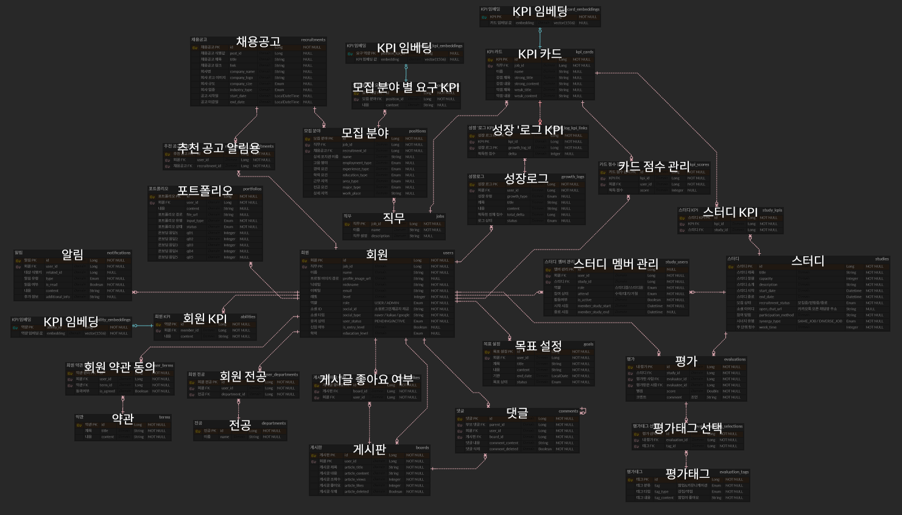

# NaviK Backend

> AI 기반 커리어 성장 추적 플랫폼 'NaviK'의 백엔드 서버입니다!

# ✨ 프로젝트 소개

**NaviK**은 주니어 개발자가 자신의 성장을 체계적으로 기록하고, AI를 활용해 역량을 분석받으며, 맞춤형 채용 공고와 스터디를 추천받을 수 있는 커리어 성장 플랫폼입니다.


<p align="center">
  <a href="https://www.navik.kr">
    🚀 서비스 바로가기
  </a>
  &nbsp; · &nbsp;
  <a href="https://api.navik.kro.kr/swagger-ui/index.html">
    📘 API 문서 (Swagger)
  </a>
</p>

## 🧭 이런 분에게 NaviK을 추천해요!

- "기록은 많은데 저의 역량이 무엇인지 모르겠어요!"
- "나에게 어울리는 채용공고를 찾고싶어요!"
- "나의 위치를 객관적으로 확인하고 싶어요!"
- "커리어의 나침반이 필요해요!"

## 🔍 Why?

- 성장 기록이 파편화되어 있어 본인의 역량 변화를 파악하기 어렵습니다.
- 직무별 핵심 역량(KPI)과 내 현재 수준의 갭을 객관적으로 파악할 수 없는 어려움이 있습니다.
- 채용 공고·스터디를 직접 찾아야 해서 시간이 많이 듭니다.

## 🔍 What?

- 성장 로그를 작성하면 AI가 직무 KPI 기준으로 평가해 점수를 매겨 객관적인 나의 위치를 확인할 수 있습니다.
- 포트폴리오를 업로드하면 AI 분석을 통해 내가 가진 강점·약점을 확인할 수 있습니다.
- 벡터 의미 유사도 기반으로 내 역량에 맞는 채용 공고·스터디를 자동 추천해드립니다.

# 📚 목차

- [프로젝트 구조](`#-프로젝트-구조`)
- [시스템 아키텍처](`#-시스템-아키텍처`)
- [기술 스택 및 도입 이유](`#-기술-스택-및-도입-이유`)
- [ERD](`#-erd`)
- [주요 기능 소개](`#-주요-기능-소개`)
- [주요 API 그룹](`#-주요-api-그룹`)
- [기술적 시도](`#-기술적-시도`)
- [배포 과정](`#-배포-과정`)
- [팀원 구성](`#-팀원-구성`)

## 📊 프로젝트 구조

```
src/main/java/navik/
├── NavikApplication.java
├── domain/                    # 도메인별 패키지
│   ├── ability/               # 역량 임베딩
│   ├── board/                 # 커뮤니티 게시판
│   ├── departments/           # 부서 관리
│   ├── evaluation/            # 동료 평가
│   ├── goal/                  # 목표 관리
│   ├── growthLog/             # 성장 로그 + AI 평가 Worker
│   ├── job/                   # 직무 정보
│   ├── kpi/                   # KPI 카드·점수
│   ├── notification/          # 알림
│   ├── portfolio/             # 포트폴리오 분석 Worker
│   ├── recruitment/           # 채용 공고 추천
│   ├── study/                 # 스터디
│   ├── term/                  # 약관
│   └── users/                 # 사용자
└── global/                    # 공통 모듈
    ├── apiPayload/            # 표준 응답 / 에러 코드
    ├── auth/                  # JWT + OAuth2 설정
    ├── config/                # Security, CORS, Redis, S3, QueryDSL 등
    ├── converter/             # 데이터 변환
    ├── entity/                # BaseEntity
    ├── enums/                 # 공통 Enum
    ├── log/                   # 로깅
    ├── s3/                    # S3 파일 업로드
    └── swagger/               # Swagger 유틸
```

각 도메인 패키지는 `controller / service / repository / entity / dto / docs` 구조를 따릅니다.

## 🛠 시스템 아키텍처


### 전체 흐름도

```
[Client] ─── REST API ─── [Spring Boot Application]
                                │
        ┌───────────────┬───────┴───────┬───────────────┐
        │               │               │               │
 [Domain Layer]   [Global Layer]  [Worker Layer]  [Crawler Layer]
 (DDD Packages)   (Auth/Config)   (Redis Stream)   (Redis Stream)
        │               │               │               │
        └───────┬───────┘               │               │
                │                       │               │
           [PostgreSQL]              [Redis] ───────────┘
           + pgvector            + Stream
                │                + Cache/Token
                │                       │
                └───────────────────────┘
                            │
                       [AI Server]
                   (평가/분석/OCR/크롤링)
```

### 1. Main API 서버 (Public Subnet)

| 분류             | 기술                                           |
|----------------|----------------------------------------------|
| Language       | Java 21                                      |
| Framework      | Spring Boot 3.5.9                            |
| Database       | PostgreSQL + pgvector                        |
| Cache / Stream | Redis                                        |
| ORM            | Spring Data JPA + QueryDSL 5.1.0             |
| Auth           | Spring Security + OAuth2 + JWT (JJWT 0.12.3) |
| Storage        | AWS S3                                       |
| Vector Search  | Hibernate Vector 6.6                         |
| API Docs       | springdoc-openapi 2.8.5 (Swagger UI)         |
| Monitoring     | Spring Actuator + Prometheus + Grafana       |
| CI/CD          | GitHub Actions → AWS ECR → EC2               |
| Container      | Docker (eclipse-temurin:21-jre)              |

### 2. 채용 공고 크롤링 및 성장 기록 분석 서버 (Private Subnet)

| 분류        | 기술                                                   |
|-----------|------------------------------------------------------|
| Language  | Java 21                                              |
| Framework | Spring boot 3.5.9 + SpringAI                         |
| Stream    | Redis                                                |
| 채용 공고 크롤링 | Selenium + JSoup + Naver Clova OCR + OpenAI          |
| 성장 기록 분석  | Notion OAuth + Github API + Naver Clova OCR + OpenAI |

### 3. 이력서 분석 서버 (Private Subnet)

| 분류        | 기술          |
|-----------|-------------|
| Language  | Python 3.11 |
| Framework | FastAPI     |
| 이력서 분석    | OpenAI      |

## 🧠 기술 스택 및 도입 이유

### 1. Main API 서버 (Public Subnet)

> 주요 역할 : 서비스 사용자의 직접적인 트래픽 처리 -> Public Subnet

---

| Category       | Stack                                                                                                                             | 도입 이유                               |
|----------------|-----------------------------------------------------------------------------------------------------------------------------------|-------------------------------------|
| Web Framework  |                    | REST API 기반 서비스 구조를 설계하고 확장하기 위해 사용 |
| Security       |  | JWT 기반 인증 및 역할별 접근 제어를 분리하기 위해 도입   |
| Authentication |                             | 무상태 인증 방식으로 확장성과 보안을 동시에 확보하기 위해 사용 |

| Category     | Stack                                                                                                             | 도입 이유                                               |
|--------------|-------------------------------------------------------------------------------------------------------------------|-----------------------------------------------------|
| RDBMS        |  | 무결성과 정합성을 갖춘 DB, 플러그인 확장으로 의미 기반 유사도 검색을 구현하기 위해 도입 |
| Cache/Stream |                 | 자주 조회되는 데이터를 캐싱, I/O 비동기 처리를 위한 Stream 자료구조 활용      |

| Category       | Stack                                                                                                              | 도입 이유                                    |
|----------------|--------------------------------------------------------------------------------------------------------------------|------------------------------------------|
| Compute        |        | 서비스 사용자의 트래픽 주로 처리하고 리소스를 독립적으로 관리하도록 사용 |
| Database       |  | 안정적인 운영과 백업/복구를 위해 관리형 데이터베이스를 도입        |
| Object Storage |           | Presigned URL을 제공하여 이력서를 업로드하기 위해 도입     |

| Category      | Stack                                                                                                                          | 도입 이유                                     |
|---------------|--------------------------------------------------------------------------------------------------------------------------------|-------------------------------------------|
| Reverse Proxy |                              | HTTPS 처리 및 트래픽 라우팅을 안정적으로 수행하기 위해 사용      |
| Container     |                           | 환경 차이 없이 동일한 실행 환경을 보장하기 위해 컨테이너 기반으로 배포  |
| CI/CD         |  | 테스트 및 배포를 자동화하여 안정적인 릴리즈를 위해 사용           |
| Monitoring    |                        | 서버 자원과 애플리케이션 상태를 시각적으로 모니터링하기 위해 사용      |
| Metrics       |               | 애플리케이션 메트릭을 수집하여 성능 이상 여부를 조기에 파악하기 위해 도입 |

---

### 2. 채용 공고 크롤링 및 성장 기록 분석 서버 (Private Subnet)

> 주요 역할 : 외부 IO가 필요한 작업 (OpenAI, NaverOCR, 채용 공고 스크래핑)
<br>
> 서비스 사용자의 트래픽을 담당하지 않고 Server to Server 이므로 -> Private

---

| Category      | Stack                                                                                                           | 도입 이유                                    |
|---------------|-----------------------------------------------------------------------------------------------------------------|------------------------------------------|
| Web Framework |  | REST API 기반 서비스 구조를 설계하고 확장하기 위해 사용      |
| AI Framework  |    | 스프링 환경에서 간편한 적용으로 LLM 및 Embedding 활용을 위함 |

| Category     | Stack                                                                                                                      | 도입 이유                                                            |
|--------------|----------------------------------------------------------------------------------------------------------------------------|------------------------------------------------------------------|
| Library      |                 | 채용 공고 사이트의 동적 크롤링 작업을 위함                                         |
| External API |                       | 비용을 우선 고려, 분석 품질 대비 비용 효율이 준수한 '4.1-mini' 사용, 임베딩은 'small' 모델 사용 |
| External API |  | 다양한 유형의 확장자에 대한 OCR 기능을 제공                                       |

| Category | Stack                                                                                              | 도입 이유                                   |
|----------|----------------------------------------------------------------------------------------------------|-----------------------------------------|
| Stream   |  | 사용자의 Notion Token 캐싱, 크롤링된 채용공고의 버퍼로 활용 |

| Category | Stack                                                                                                        | 도입 이유                                    |
|----------|--------------------------------------------------------------------------------------------------------------|------------------------------------------|
| Compute  |  | Main 서버의 요청을 주로 처리하고 리소스를 독립적으로 관리하도록 사용 |

| Category  | Stack                                                                                                                          | 도입 이유                                    |
|-----------|--------------------------------------------------------------------------------------------------------------------------------|------------------------------------------|
| Container |                           | 환경 차이 없이 동일한 실행 환경을 보장하기 위해 컨테이너 기반으로 배포 |
| CI/CD     |  | 테스트 및 배포를 자동화하여 안정적인 릴리즈를 위해 사용          |

---

### 3. 이력서 분석 서버 (Private Subnet)

> 주요 역할 : 파일 유형이 늘어나는 요구사항에 대비, '파일 관련 라이브러리 생태계'가 풍부한 파이썬이 적합하다고 판단
<br>
> 외부 IO 작업만 처리 (OpenAI) -> Private Subnet
---

| Category      | Stack                                                                                                    | 도입 이유                                                            |
|---------------|----------------------------------------------------------------------------------------------------------|------------------------------------------------------------------|
| Web Framework |  | 파이썬 환경에서 REST API 기반 서비스 구조를 설계하고 확장하기 위해 사용                     |
| External API  |     | 비용을 우선 고려, 분석 품질 대비 비용 효율이 준수한 '4.1-mini' 사용, 임베딩은 'small' 모델 사용 |

| Category | Stack                                                                                                        | 도입 이유                                    |
|----------|--------------------------------------------------------------------------------------------------------------|------------------------------------------|
| Compute  |  | Main 서버의 요청을 주로 처리하고 리소스를 독립적으로 관리하도록 사용 |

| Category  | Stack                                                                                                                          | 도입 이유                                    |
|-----------|--------------------------------------------------------------------------------------------------------------------------------|------------------------------------------|
| Container |                           | 환경 차이 없이 동일한 실행 환경을 보장하기 위해 컨테이너 기반으로 배포 |
| CI/CD     |  | 테스트 및 배포를 자동화하여 안정적인 릴리즈를 위해 사용          |

---

## 🧩 ERD



## ✨ 주요 기능 소개

| 기능           | 설명                                                                                   |
|--------------|--------------------------------------------------------------------------------------|
| **성장 로그**    | 활동·학습·성과를 기록하고 AI 평가(비동기 Worker)를 받아 KPI 점수에 반영 (Text, PDF, Notion, Github PR 분석 지원) |
| **포트폴리오 분석** | PDF/텍스트 포트폴리오 업로드 → AI 분석 → 강점·약점 리포트                                                |
| **KPI 카드**   | 직무별 핵심 역량 카드와 레이더 차트로 내 역량 시각화                                                       |
| **채용 공고 추천** | pgvector 기반 의미 유사도로 내 역량에 맞는 채용 공고 자동 매칭                                             |
| **스터디**      | 스터디 생성·참여·동료 평가, KPI 유사도 기반 스터디 추천                                                   |
| **커뮤니티**     | 직무별 게시판, 댓글, 좋아요, 인기글 랭킹                                                             |
| **소셜 로그인**   | Google · Kakao · Naver OAuth2 지원                                                     |

## 📚 주요 API 그룹

Swagger UI를 통해 전체 API 명세를 확인할 수 있습니다.

- **로컬**: http://localhost:8080/swagger-ui/index.html
- **프로덕션**: https://api.navik.kro.kr/swagger-ui/index.html

| 그룹            | Prefix              | 설명                    |
|---------------|---------------------|-----------------------|
| Auth          | `/v1/auth`          | 토큰 갱신, 로그아웃           |
| Users         | `/v1/users`         | 프로필, 온보딩, 마이페이지       |
| Abilities     | `/v1/abilities`     | 역량 조회                 |
| Growth Logs   | `/v1/growth-logs`   | 성장 로그 CRUD + AI 평가    |
| Portfolios    | `/v1/portfolios`    | 포트폴리오 등록 + AI 분석      |
| KPI Cards     | `/v1/kpi-cards`     | KPI 카드 조회, Top/Bottom |
| KPI Scores    | `/v1/kpi-scores`    | 레이더 차트 데이터            |
| Boards        | `/v1/boards`        | 게시글 CRUD, 인기글, 검색     |
| Comments      | `/v1/comments`      | 댓글 CRUD               |
| Studies       | `/v1/studies`       | 스터디 생성·참여·추천          |
| Evaluations   | `/v1/evaluations`   | 동료 평가                 |
| Recruitments  | `/v1/recruitments`  | 채용 공고 추천              |
| Goals         | `/v1/goals`         | 개인 목표 관리              |
| Notifications | `/v1/notifications` | 알림 조회                 |

## 🛠 기술적 시도

### 1. Cursor 기반 조회 쿼리

```
[Limit/Offset Query] = Count Query + Limit/Offset로 인한 성능 저하
```

- Workbook Cursor를 활용하여 조회 성능 개선

### 2. 비동기 Worker 아키텍처

```
[Client] → [Main API Server] → [Redis Stream] → [Worker] → [AI Server] (I/O) 
                                                    ↓
                                              [DB 결과 저장]
```

- 성장 로그 평가, 포트폴리오 분석은 Redis Stream 기반 비동기 Worker로 처리됩니다
- Worker는 poll 방식으로 Stream을 소비하며, claim 메커니즘으로 실패한 메시지를 재처리합니다

### 3. 채용 공고 비동기 추출&적재 파이프라인

```
[Crawler Server] → [Redis Stream] → [Main API Server]
                                           ↓
                                      [DB 결과 저장]
```

- 추출 <-> 적재의 분리로 단일 장애 포인트 제거
- JdbcTemplate을 통해 직접 Batch Insert Query를 작성하여 적재 속도 개선

### 4. Redis 캐싱을 활용한 조회 성능 개선

```
[Client] → [HIT: Redis Cache] → [MISS: REST API]
                                       ↓
                                    [DB 조회]
```

- 자주 조회되는 데이터 캐싱으로 사용자 경험 개선

### 5. 모니터링 서버 구축

```
[Spring Actuator] → [Prometheus] → [Grafana]
```

- API 요청 및 응답 속도 시각화, p95, p99, 쿼리 개수 등을 직접 확인하며 병목 지점 파악

### 6. 그 밖의 성능 개선을 위한 시도

- 상호 간 코드 리뷰로 병목 지점 사전 파악 및 개선
- Repository 조회 시 Projection을 적용하여 N+1의 원인 제거
- QueryDSL을 활용하여 동적 검색 필터 처리 + 컴파일 타임 안정성 확보

## 🚀 배포 과정

GitHub Actions를 통해 자동 배포됩니다.

| 워크플로            | 트리거              | 동작                                  |
|-----------------|------------------|-------------------------------------|
| `integrate.yml` | `develop` 브랜치 PR | 테스트 실행 + merge 시뮬레이션 검증             |
| `deploy.yml`    | `main` 브랜치 push  | JAR 빌드 → Docker → ECR push → EC2 배포 |

배포 후 Discord 웹훅으로 결과 알림이 전송됩니다.

## 👤 팀원 구성

|  |  |  |  |  |
|:-------------------------------------------------------------------------------------------:|:------------------------------------------------------------------------------------------:|:------------------------------------------------------------------------------------------:|:-------------------------------------------------------------------------------------------:|:-------------------------------------------------------------------------------------------:|
|                     @kjhh2605<br/>[GitHub](https://github.com/kjhh2605)                     |                     @bmh7190<br/>[GitHub](https://github.com/bmh7190)                      |                   @kfdsy0103<br/>[GitHub](https://github.com/kfdsy0103)                    |                    @hardwoong<br/>[GitHub](https://github.com/hardwoong)                    |                   @LeeJaeJun1<br/>[GitHub](https://github.com/LeeJaeJun1)                   |
|     <small>• Social/Notion OAuth 인증 처리<br/>• 성장 로그 분석 서버 담당<br/>• 이벤트 기반 레벨링 설계</small>     |         <small>• AWS 인프라 및 CI/CD 구축<br/>• 성장 로그 API 담당<br/>• 비동기 워커 로직 설계</small>          |               <small>(Lead)<br/>• 채용 공고 추출/적재 및 추천<br/>• 모니터링 환경 구축</small>                |               <small>• FastAPI 분석 서버 담당<br/>• Few-Shot 프롬프트 활용 일치율 개선</small>               |                <small>• 소셜 기능 담당<br/>• Redis 캐싱 처리<br/>• 카운트 원자적 제어</small>                 |

## Credits

- [Spring Boot](https://spring.io/projects/spring-boot)
- [pgvector](https://github.com/pgvector/pgvector)
- [springdoc-openapi](https://springdoc.org)